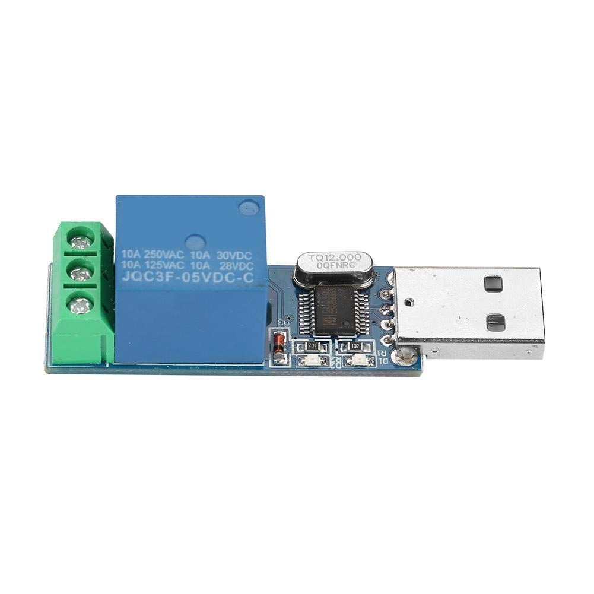
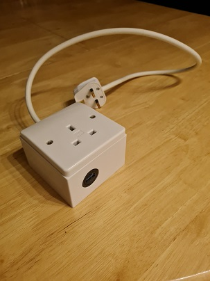
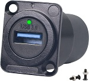

# PowerSaver
This is a power saving project designed to discharge a laptop once the battery is full and begin the charge when it falls below 15%.<br>
Due to changing jobs and varied permissions I've had to write the code in C#, VBA and ASP.net. The project requires the purchase of a USB relay along with any additional cosmetic or safety hardware such as cable, a socket box and USB adapter.

## Hardware requirements and wiring
A picture<br>
</img>
</img>
</img>

## Software requirements
The driver for the USB relay is required along with some software to write the code that may include anything from Office, which could utilise Access; Excel; Outlook, or some other IDE like Visual Studio where another language of personal choice could be used.

## Set up 1 - C#
```
Some code
```

## Set up 2 - VBA
```
Option Explicit
Private Declare PtrSafe Function GetSystemPowerStatus Lib "Kernal32" (lpSystemPowerStatus as SYSTEM_POWER_STATUS) as LongPtr
Private Declare PtrSafe Function SetTimer Lib "user32" (ByVal hwnd As LongLong, ByVal nIDEvent as LongLong, ByVal uElapse as LongLong, ByVal lpTimerfunc as LongLong) As LongLong
Private Declare PtrSafe Function KillTimer Lib "user32"(ByVal hwnd as LongLong, ByVal nIDEvent as LongLong) as LongLong

Private timerID as LongLong
Dim powered as Boolean
Dim useOption2 As Boolean

Private Type SYSTEM_POWER_STATUS
  ACLineStatus as Byte
  BatteryFlag as Byte
  BatteryLifePercent as Byte
  SystemStatusFlag as Byte
  BatteryLifeTime as Long
  BatteryFullLifeTime as Long
End Type

Public Sub DeactivateTimer()
  Dim lsuccess As LongLong
  
  On Error GoTo err_handler
  
End Sub


```

