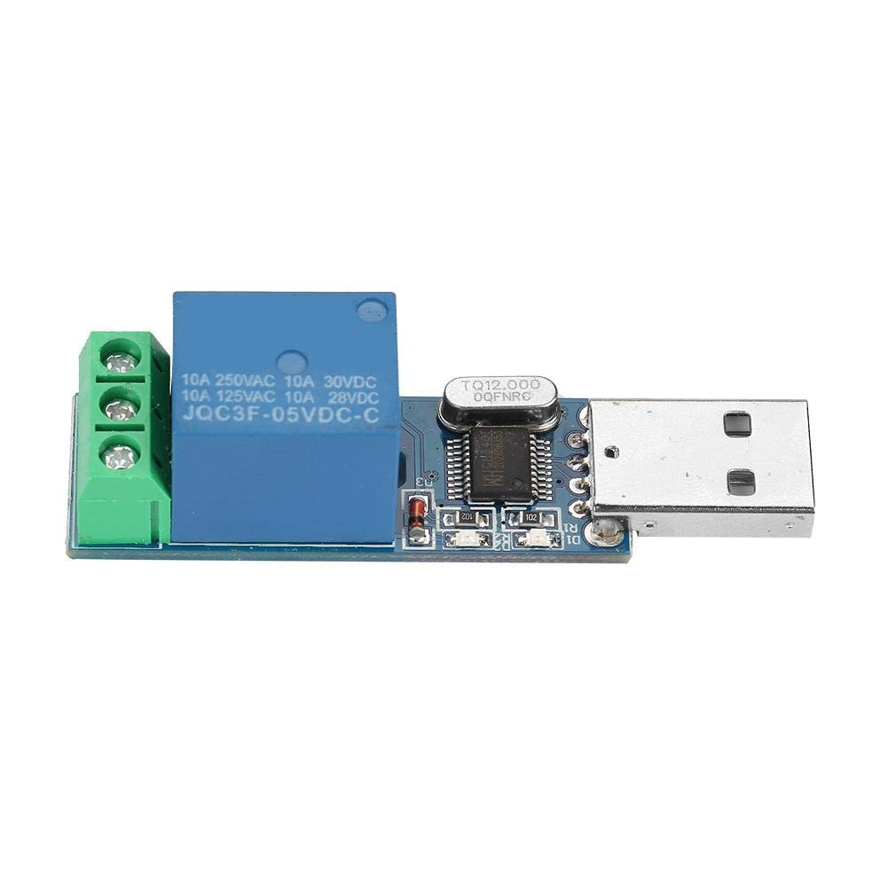

<a href="README.md">back</a>
## Hardware requirements and wiring

| </img> | </img> | </img> |
| - | - | - |
| 
Relay
 | 
Socket & lead
 | 
USB union
 |

### LCUS-1 type USB Relay (<a href="https://www.aliexpress.com/item/32827365539.html?_randl_currency=GBP&_randl_shipto=GB&src=google&src=google&albch=shopping&acnt=708-803-3821&slnk=&plac=&mtctp=&albbt=Google_7_shopping&albagn=888888&isSmbAutoCall=false&needSmbHouyi=false&albcp=17858099691&albag=&trgt=&crea=en32827365539&netw=x&device=c&albpg=&albpd=en32827365539&gclid=Cj0KCQjwkt6aBhDKARIsAAyeLJ3syTrC1nNmodiioPs5ZryEJpC3TcitGlJIp7_LRF68ZTJOv_cY97saAil7EALw_wcB&gclsrc=aw.ds&aff_fcid=8c1f9413262d44ceb45e970bb34a015e-1666726753049-00514-UneMJZVf&aff_fsk=UneMJZVf&aff_platform=aaf&sk=UneMJZVf&aff_trace_key=8c1f9413262d44ceb45e970bb34a015e-1666726753049-00514-UneMJZVf&terminal_id=6c7aad3474244a3497526c1ce849bae5&afSmartRedirect=y">see specs</a>)
The USB relay has clear markings to identify where to place the power cables to form a circuit.
- NO - Normal Open
This is the live out if your circuit is designed to operate when the relay is switched on, This is the one we use in this project.
- COM - Common
This is the live in
- NC - Normal Closed
This is your live out if your circuit is dsigned to operate when the relay is switched off. We will not be using this one.

### Socket & Lead
So this contraption is a combination of an extension lead and socket box. I had to drill a cable sized hole in the side of the box to tidily feed the cable through from the extension lead after cutting the socket end off to just leave the plug and cable. I also had to drill, very carefully, a hole to fit the USB union join in so that it sits flush with the case.

### USB Union Join
This USB female to female join allows you to plug the USB relay into one end, this sits snug inside the socket box, but it wouldn't fit directly, I had to get a small male to female USB extension lead to join relay to the union and squash it in the box at the diaganal corner to corner position.

